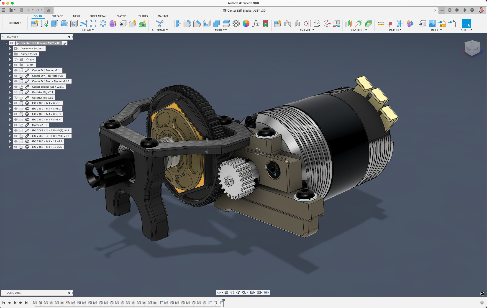
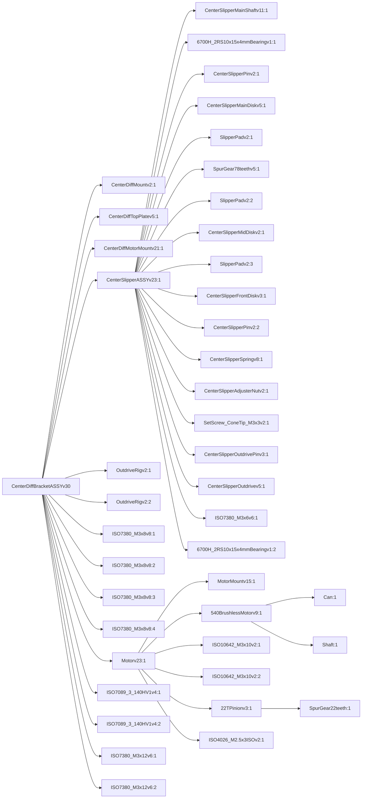

# Fusion-360-Graph-Mermaid

Export an assembly as a Mermaid mmd file.

Example Assembly:

Graph created from shown example:

```mermaid
    graph LR;
    CenterDiffBracketASSYv30-->CenterDiffMountv2:1;
    CenterDiffBracketASSYv30-->CenterDiffTopPlatev5:1;
    CenterDiffBracketASSYv30-->CenterDiffMotorMountv21:1;
    CenterDiffBracketASSYv30-->CenterSlipperASSYv23:1;
    CenterSlipperASSYv23:1-->CenterSlipperMainShaftv11:1;
    CenterSlipperASSYv23:1-->6700H_2RS10x15x4mmBearingv1:1;
    CenterSlipperASSYv23:1-->CenterSlipperPinv2:1;
    CenterSlipperASSYv23:1-->CenterSlipperMainDiskv5:1;
    CenterSlipperASSYv23:1-->SlipperPadv2:1;
    CenterSlipperASSYv23:1-->SpurGear78teethv5:1;
    CenterSlipperASSYv23:1-->SlipperPadv2:2;
    CenterSlipperASSYv23:1-->CenterSlipperMidDiskv2:1;
    CenterSlipperASSYv23:1-->SlipperPadv2:3;
    CenterSlipperASSYv23:1-->CenterSlipperFrontDiskv3:1;
    CenterSlipperASSYv23:1-->CenterSlipperPinv2:2;
    CenterSlipperASSYv23:1-->CenterSlipperSpringv8:1;
    CenterSlipperASSYv23:1-->CenterSlipperAdjusterNutv2:1;
    CenterSlipperASSYv23:1-->SetScrew_ConeTip_M3x3v2:1;
    CenterSlipperASSYv23:1-->CenterSlipperOutdrivePinv3:1;
    CenterSlipperASSYv23:1-->CenterSlipperOutdrivev5:1;
    CenterSlipperASSYv23:1-->ISO7380_M3x6v6:1;
    CenterSlipperASSYv23:1-->6700H_2RS10x15x4mmBearingv1:2;
    CenterDiffBracketASSYv30-->OutdriveRigv2:1;
    CenterDiffBracketASSYv30-->OutdriveRigv2:2;
    CenterDiffBracketASSYv30-->ISO7380_M3x8v8:1;
    CenterDiffBracketASSYv30-->ISO7380_M3x8v8:2;
    CenterDiffBracketASSYv30-->ISO7380_M3x8v8:3;
    CenterDiffBracketASSYv30-->ISO7380_M3x8v8:4;
    CenterDiffBracketASSYv30-->Motorv23:1;
    Motorv23:1-->MotorMountv15:1;
    Motorv23:1-->540BrushlessMotorv9:1;
    540BrushlessMotorv9:1-->Can:1;
    540BrushlessMotorv9:1-->Shaft:1;
    Motorv23:1-->ISO10642_M3x10v2:1;
    Motorv23:1-->ISO10642_M3x10v2:2;
    Motorv23:1-->22TPinionv3:1;
    22TPinionv3:1-->SpurGear22teeth:1;
    Motorv23:1-->ISO4026_M2.5x3ISOv2:1;
    CenterDiffBracketASSYv30-->ISO7089_3_140HV1v4:1;
    CenterDiffBracketASSYv30-->ISO7089_3_140HV1v4:2;
    CenterDiffBracketASSYv30-->ISO7380_M3x12v6:1;
    CenterDiffBracketASSYv30-->ISO7380_M3x12v6:2;
```

Layout style and direction can be changed in the script.
